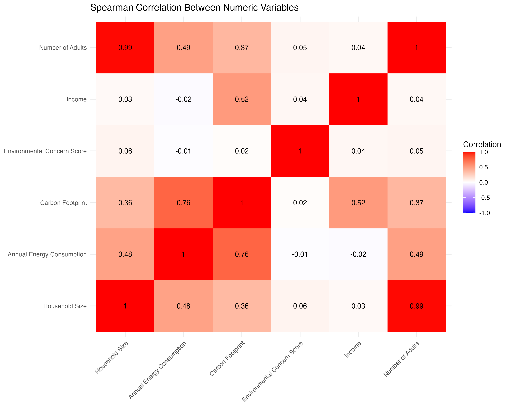
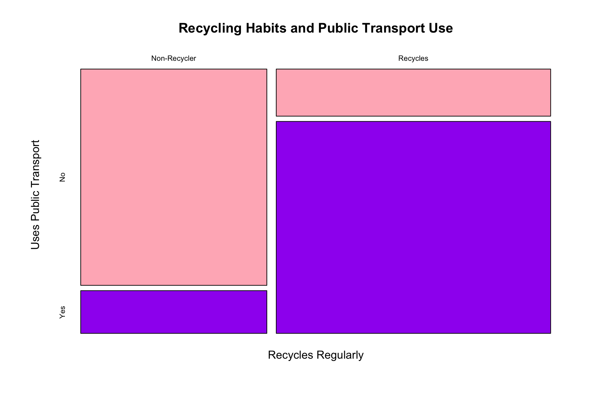
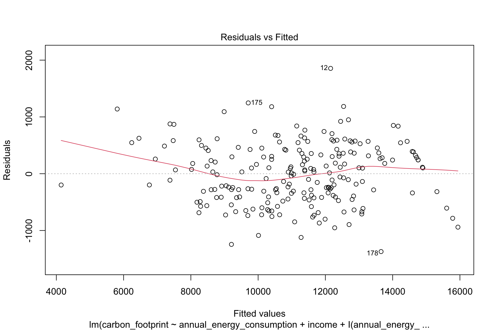

# 🌱 Household Carbon Footprint Analysis

## Overview

This project explores factors associated with household carbon
footprints and recycling behaviour using R.

The analysis involved data cleaning, exploratory data analysis,
data visualisation and statistical modelling.

## Research Questions

1. Which household characteristics are associated with carbon footprint?
2. Which factors are associated with the likelihood of regularly recycling?

## 🛠️ Tools & Technologies

- R
- tidyverse
- ggplot2
- mgcv
- car

## 📊 Methods

The analysis included:

- Data cleaning and quality assessment
- Exploratory data analysis (EDA)
- Data visualisation
- Spearman's correlation
- Generalised Additive Models (GAM)
- Multiple linear regression
- Logistic regression

## 📊 Selected Visualisations

### Correlation Between Numerical Variables

Spearman's correlation was used to explore relationships between numerical
variables. Annual energy consumption showed the strongest positive correlation
with carbon footprint.

### Recycling Habits and Public Transport Use

The mosaic plot shows the relationship between regular recycling and public
transport use. Individuals who recycled regularly were more likely to use
public transport, suggesting an association between these environmental
behaviours.

### Multiple Linear Regression Model Diagnostics

A multiple linear regression model was developed to investigate factors
associated with household carbon footprint. The final model achieved an
adjusted R² of 0.935, explaining approximately 94% of the variation in carbon
footprint within the analysed sample.

Model diagnostics were used to assess the assumptions and suitability of
the final model.

## 🔎 Key Findings

The final multiple regression model explained approximately 94%
of the variation in carbon footprint within the analysed sample.

Annual energy consumption and income were identified as important
predictors, with evidence of non-linear and interaction effects.

Recycling behaviour was investigated separately using logistic
regression.

## 📂 Data

The dataset used in this project was provided for academic purposes
and is therefore not included in this public repository.

The R Markdown and rendered HTML report are provided to demonstrate
the analytical workflow and results.

## 📁 Repository Contents

- `carbon-footprint-analysis.Rmd` — R Markdown containing the analysis and code
- `carbon-footprint-analysis.html` — Rendered report containing code, outputs and visualisations
- `README.md` — Project overview
